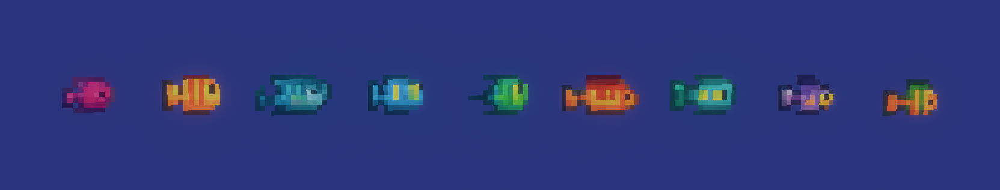
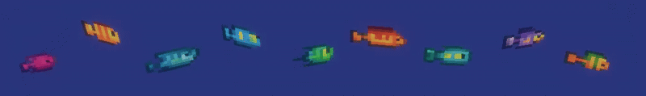
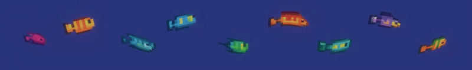

+++
title = "Vertex Shaders in Bevy"
date = 2025-06-22
description = "A Bevy vertex shader that simulates a fish wobbling in the water."
tags = ["bevy", "vertex", "shaders", "graphics"]
categories = ["game dev", "programming"]
showHero = true
draft = false
+++

## Background

I recently started learning the [Bevy](https://bevy.org/) game engine to build a [*2.5D perspective*](https://en.wikipedia.org/wiki/2.5D) game with similar aesthetics to [The Last Night](https://store.steampowered.com/app/612400/The_Last_Night/) and [Delver](https://store.steampowered.com/app/249630/Delver/).


I envision a simple **underwater [shoot 'em up](https://sv.wikipedia.org/wiki/Shoot_%27em_up)** game with lots of fish swimming around.
\
To add a bit of **visual flair**, I decided to write a **vertex shader** that makes **fish sprites wobble as if they were swimming in water**.
\
Being my first attempt at writing vertex shaders, I was struggling and had a hard time finding good examples and relevant resources.
I hope this post will help others who are new to Bevy and vertex shaders to get started with creating interesting visual effects.

Let's *dive in*!

## Terminology

Before we get started, let's clarify some technical details that are important to understand when working with Bevy and shaders.

| Word            | Definition                                                                                                                                                                         |
| --------------- | ---------------------------------------------------------------------------------------------------------------------------------------------------------------------------------- |
| Vertex          | **Point in 3D space** *(+normal and UV info)* used to define object models and shapes.                                                                                             |
| Mesh            | **Collection of vertices** that define an object.                                                                                                                                  |
| Shader          | Code that runs **in parallel** on the GPU written in a language like [**GLSL**](https://sv.wikipedia.org/wiki/OpenGL_Shading_Language) or [**WGSL**](https://www.w3.org/TR/WGSL/). |
| Vertex Shader   | Process vertex data and **transform vertex positions**.                                                                                                                            |
| Fragment Shader | **Calculate the color of a pixel** (≈ fragment) on the screen.                                                                                                                     |
| Compute Shader  | Perform **general-purpose computations** on the GPU.                                                                                                                               |
| Pipeline        | **Sequence of processes** to render a scene, e.g., `vertex shader` → `fragment shader`.                                                                                            |

## Game Setup

Let's begin by defining the main function that initializes the Bevy app and sets up the necessary plugins and resources.

`src/main.rs`:

```rust
use crate::fish_wobble::{FishWobbleExt, WobbleParams, stripe_quads};
use bevy::prelude::*;
use bevy::pbr::ExtendedMaterial;

fn main() {
    App::new()
        .add_plugins(DefaultPlugins.set(ImagePlugin::default_nearest()))
        .insert_resource(ClearColor(Color::srgb(0.15, 0.2, 0.5)))
        .add_systems(Startup, setup)
        .run();
}

fn setup(
    assets: Res<TextureAssets>,
    mut commands: Commands,
    mut meshes: ResMut<Assets<Mesh3d>>,
    mut materials: ResMut<Assets<StandardMaterial>>,
) {
    // Setup the camera
    commands.spawn((
        Name::new("Main Camera"),
        Camera3d::default(),
        Transform::from_xyz(0.0, 1.75, 1.75).looking_at(Vec3::ZERO, Vec3::Y)
    ))

    // Spawn multiple fish at different positions
    let N = assets.fish.len();
    for i in 0..N {
        let x = (i as f32 - N as f32 / 2.0) * 0.2;
        commands.spawn((
            Name::new(format!("Fish {}", i)),
            Mesh3d(meshes.add(RectangleMeshBuilder::new(w, h).build())),
            MeshMaterial3d(materials.add(StandardMaterial {
                base_color_texture: Some(assets.fish[i].clone()),
                unlit: true,
                alpha_mode: AlphaMode::Blend,
                ..default()
            })),
            Transform::from_xyz(x, 0.0, 0.0)
        ));
    }
}
```

> Asset loading, mesh building and unrelated code is redacted for brevity.\
> You can find the complete code on [GitHub](https://github.com/WilliamRagstad/bevy_coralbeef).

This refers to a `setup` function that will be called when the app starts, and a `shader_fish_wobble` function that will update the fish wobble `time` parameter every frame.
We will come back to these functions later.
\
Before using any custom shaders, simply loading all assets and rendering them using `StandardMaterial` and `RectangleMeshBuilder`, our game looks like this:


## Fish Wobble Shader

To create the fish wobble effect, we will write a **vertex shader** that modifies the vertex positions of the fish sprites based on a `sin` wave function, which gives the appearance of movement.

We will also need to define a **custom `FishWobbleExt` material** that **extends the `StandardMaterial`** with our **fish wobble effect**.
This is because Bevy's `StandardMaterial` does not support custom vertex shaders and we want to piggyback on its existing render functionality.

```rust
type FishMaterialExt = ExtendedMaterial<StandardMaterial, FishWobbleExt>;
```

> `ExtendedMaterial` is generic in the base type. Re-using `StandardMaterial`'s bindings, lighting model, shadow passes, reflection probes, etc., while still letting you tamper with vertices freely in `FishWobbleExt`.

Let's review the `FishWobbleExt` material and how it is implemented.

`src/fish_wobble.rs`:

```rust
use bevy::{
    asset::RenderAssetUsages,
    pbr::MaterialExtension,
    prelude::*,
    reflect::TypePath,
    render::render_resource::{AsBindGroup, ShaderRef, ShaderType},
};

#[derive(ShaderType, Copy, Default, Debug, Clone)]
pub struct WobbleParams {
    pub amplitude: f32,
    pub frequency: f32,
    pub speed: f32,
    pub phase: f32,
    pub time: f32,
}

#[derive(AsBindGroup, Asset, TypePath, Default, Debug, Clone)]
pub struct FishWobbleExt {
    #[uniform(100)]
    pub params: WobbleParams,
}

impl MaterialExtension for FishWobbleExt {
    fn vertex_shader() -> ShaderRef {
        "shaders/fish_wobble.wgsl".into()
    }
}
```

It's not much code, but it does a few important things:

1. **`WobbleParams` struct**: This `ShaderType` struct holds the parameters that will be passed to the vertex shader.
2. **`FishWobbleExt` struct**: This `AsBindGroup` struct is an asset that holds the `WobbleParams` and allows the material to be used as a bind group in the rendering pipeline, which is necessary for passing parameters to the shader correctly by specifying it as a `uniform` at offset `100`.
   - The `#[uniform(100)]` attribute indicates that this struct will be used as a uniform buffer in the shader, and the offset of `100` is used to ensure it does not conflict with other uniforms.
   - The `Asset` and `TypePath` traits are implemented to allow Bevy to manage this material as an asset.
3. **Implements `MaterialExtension` trait**: This trait allows us to define a custom vertex shader for the `FishWobbleExt` material.
    - The `vertex_shader` function returns the path to the WGSL shader file that will be used for the wobble effect.

> All extended materials in Bevy must implement the `MaterialExtension` trait, which allows them to define custom shaders and parameters which are passed in **binding group 2**.

`assets/shaders/fish_wobble.wgsl`:

```wgsl
#import bevy_pbr::{
    mesh_functions,
    forward_io::{Vertex, VertexOutput},
    view_transformations::position_world_to_clip
}

struct WobbleParams {
    amplitude : f32,
    frequency : f32,
    speed     : f32,
    phase     : f32,
    time      : f32,
};

@group(2) @binding(100)
var<uniform> params : WobbleParams;

@vertex
fn vertex(in: Vertex) -> VertexOutput {
    /* --- Model → World transform (Bevy helper) ------------------- */
    var model = mesh_functions::get_world_from_local(in.instance_index);
    var world_pos = mesh_functions::mesh_position_local_to_world(
        model,
        vec4<f32>(in.position, 1.0)
    );

    /* --- Apply wobble in world space ----------------------------- */
    let phase = in.position.x * params.frequency +
                (params.time + params.phase) * params.speed;
    world_pos.z += sin(phase) * params.amplitude;

    /* --- Fill the required output struct ------------------------- */
    var out : VertexOutput;
    out.world_position = world_pos;
    out.position = position_world_to_clip(world_pos.xyz);

    /* Pass-through you may need later */
    out.world_normal = mesh_functions::mesh_normal_local_to_world(
        in.normal, in.instance_index
    );
    out.uv = in.uv;

    return out;
}
```

Now here's the meat of this post: the vertex shader itself.
Let's break it down step by step:

1. Import some Bevy PBR helper functions useful for transforming positions from model space to world space and then to clip space.
2. Define the `WobbleParams` struct that matches `WobbleParams` in our Rust code. This struct will be used to pass parameters to the shader.
3. Use the `@group(2) @binding(100)` attributes to bind the `params` uniform to binding group 2 at offset 100, which is where our `FishWobbleExt` material expects it.
4. The `vertex` function is the **entry point** for the vertex shader and **will be called for each vertex in the mesh**. It takes a `Vertex` input, which contains the vertex data such as position, normal, and UV coordinates.
   1. We use Bevy's helper function `get_world_from_local` to get the model matrix for the current instance and transform the vertex position from local space to world space.
   2. We then **apply the wobble effect** by modifying the `z` coordinate of  the world position based on a sine wave function. The sine wave is calculated using the `x` position of the vertex, the `frequency`, `speed`, and `phase` parameters, and the current time.
   3. Finally, we fill the `VertexOutput` struct with the transformed world position, clip position, world normal, and UV coordinates. The `position_world_to_clip` function is used to transform the world position to clip space, which is necessary for rendering.
   4. The `mesh_normal_local_to_world` function is used to transform the normal vector from local space to world space, which is useful for lighting calculations later on.

Let's go back to the `setup` function in `src/main.rs` and see how we can use this material to improve the rendering of our fish sprites.

`src/main.rs` *(continued)*:

```rust
mod fish_wobble;

fn main() {
    App::new()
        // ... Same as before
        .add_plugins(MaterialPlugin::<FishMaterialExt>::default()) // New
        .add_systems(Update, shader_fish_wobble) // New
        .run();
}

fn setup(
    assets: Res<TextureAssets>,
    mut commands: Commands,
    mut materials: ResMut<Assets<FishMaterialExt>>,
    mut meshes: ResMut<Assets<Mesh3d>>,
) {
    // ... (other setup code)

    // Spawn multiple fish at different positions
    let N = assets.fish.len();
    for i in 0..N {
        let w = /* ... */; // Width of the fish sprite
        let h = /* ... */; // Height of the fish sprite
        let x = (i as f32 - N as f32 / 2.0) * 0.2;
        commands.spawn((
            Name::new(format!("Fish {}", i)),
            Mesh3d(meshes.add(RectangleMeshBuilder::new(w, h).build())),
            MeshMaterial3d(materials.add(ExtendedMaterial {
                base: StandardMaterial { /* ... */ }, // Same as before
                extension: FishWobbleExt {
                    params: WobbleParams {
                        amplitude: 0.03,
                        frequency: 15.0,
                        speed: 2.0,
                        phase: index as f32 * 17.5,
                        ..default()
                    },
                },
            })),
            Transform::from_xyz(x, 0.0, 0.0)
        ));
    }
}

/// Update the fish wobble parameters every frame
/// to animate the wobble effect in the shader.
fn shader_fish_wobble(mut mats: ResMut<Assets<FishMaterialExt>>, time: Res<Time>) {
    for (_id, mat) in mats.iter_mut() {
        mat.extension.params.time = time.elapsed_secs();
    }
}
```

We need to update the `time` parameter of each component with the `FishWobbleExt` material to *drive* the wobble effect.
Remember the formula in the shader? `time` is used to calculate the phase of the sine wave.

```wgsl
let phase = in.position.x * params.frequency +
            (params.time + params.phase) * params.speed;
world_pos.z += sin(phase) * params.amplitude;
```

With these changes, our fish sprites will now wobble by moving the vertices in the `z` direction.
Our game now looks like this:



### Subdividing

Even though the fish sprites are now wobbling, they still look like dead flat rectangles.
It is missing snappy and lively fluid motion of real fish.\
Our shader is agnostic to the mesh we use, so we can **improve the visual effect by subdividing the rectangle into smaller vertical quads**.



`src/main.rs`:

```rust
pub fn stripe_quads(w: f32, h: f32) -> Mesh {
    let mut mesh = Mesh::new(
        bevy::render::mesh::PrimitiveTopology::TriangleList,
        RenderAssetUsages::default(),
    );
    let mut positions = Vec::new();
    let mut normals = Vec::new();
    let mut uvs = Vec::new();
    let mut indices = Vec::new();
    let stripe_width = w / 8.0; // 8 stripes
    let stripe_height = h;
    let mut x_offset = 0.0;
    for i in 0..8 {
        // Rectangle corners
        let bl = Vec3::new(x_offset, 0.0, 0.0); // Bottom-left
        let br = Vec3::new(x_offset + stripe_width, 0.0, 0.0); // Bottom-right
        let tr = Vec3::new(x_offset + stripe_width, stripe_height, 0.0); // Top-right
        let tl = Vec3::new(x_offset, stripe_height, 0.0); // Top-left

        positions.extend_from_slice(&[bl, br, tr, tl]);
        // All normals point out of the screen (z+)
        normals.extend_from_slice(&[
            [0.0, 0.0, 1.0],
            [0.0, 0.0, 1.0],
            [0.0, 0.0, 1.0],
            [0.0, 0.0, 1.0],
        ]);
        // UVs: map each stripe to its portion of the texture
        let u0 = x_offset / w;
        let u1 = (x_offset + stripe_width) / w;
        uvs.extend_from_slice(&[
            [u0, 1.0], // bl
            [u1, 1.0], // br
            [u1, 0.0], // tr
            [u0, 0.0], // tl
        ]);
        let start_index = (i * 4) as u32;
        indices.extend_from_slice(&[
            start_index,     // Bottom-left
            start_index + 1, // Bottom-right
            start_index + 2, // Top-right
            start_index,     // Bottom-left
            start_index + 2, // Top-right
            start_index + 3, // Top-left
        ]);
        x_offset += stripe_width;
    }
    mesh.insert_attribute(Mesh::ATTRIBUTE_POSITION, positions);
    mesh.insert_attribute(Mesh::ATTRIBUTE_NORMAL, normals);
    mesh.insert_attribute(Mesh::ATTRIBUTE_UV_0, uvs);
    mesh.insert_indices(bevy::render::mesh::Indices::U32(indices));
    mesh
}
```

Then let's update the `setup` function to use this new mesh instead of the flat rectangle mesh.

`src/main.rs` *(continued)*:

```rust
// ... (other setup code)
commands.spawn((
    Name::new(format!("Fish {}", i)),
    Mesh3d(meshes.add(stripe_quads(w, h))),
    MeshMaterial3d(materials.add(ExtendedMaterial {
        base: StandardMaterial { /* ... */ }, // Same as before
        extension: FishWobbleExt {
            params: WobbleParams {
                amplitude: 0.03,
                frequency: 15.0,
                speed: 2.0,
                phase: index as f32 * 17.5,
                ..default()
            },
        },
    })),
    Transform::from_xyz(x, 0.0, 0.0)
));
```

With this final change, our fish sprites now have a more dynamic and pronounced wobbling effects.



## Further Improvements

There are many ways to improve the fish wobble effect and make it more visually appealing. Here are some ideas:

- **Add more parameters**: Introduce more parameters to control the wobble effect, such as `damping`, `randomness`, or `direction`.
- **Use noise functions**: Instead of a simple sine wave, use noise functions like [Perlin noise](https://en.wikipedia.org/wiki/Perlin_noise) or [Simplex noise](https://en.wikipedia.org/wiki/Simplex_noise) to create more organic and natural movement.
- Implement `deferred_vertex_shader` to also render shadows in deferred rendering pipelines.
- **Combine with fragment shaders**: Use fragment shaders to add more visual effects, such as color gradients, lighting, or texture blending.
- **Animate the fish**: Add animations to the fish sprites to make them more lively, such as moving their fins or tails.

## Conclusion

In this post, we explored how to create a simple fish wobble effect using Bevy's vertex shaders.
We learned how to define a custom material that extends `StandardMaterial` and how to write a vertex shader that modifies the vertex positions based on a sine wave function.
We also saw how to use Bevy's helper functions to transform positions from model space to world space and then to clip space.
