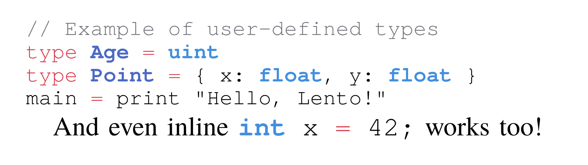

+++
title = "Custom Syntax Highlighting"
date = 2025-11-14
description = "A tutorial on how to create custom syntax themes for Typst's code blocks."
tags = [ "syntax", "highlighting", "themes", "customization", "languages"]
categories = ["typst"]
showHero = true
draft = false
+++

## Background

**I love Typst**, it's an *awesome alternative to LaTeX* for creating typeset documents!
However, I recently ran into issues when writing a programming paper.
I wanted to include code snippets in a programming language that Typst does not natively support.
Meaning, **the default language syntax highlighting support weren't sufficient** for me.

Typst supply a few primitive ways of loading custom syntax themes in `raw` code blocks, these are **neither well-documented nor flexible**.
That's why in this post, I'll show you how to add support for custom Typst languages by creating syntax and themes definitions in a scalable manner!

## `Raw` Code

In Typst, we can create code blocks using either ` ``` ` or the `raw()` text element, specifying the language, supported syntax, and theme as parameters.

```hs
raw(
    lang: nonestr,           -- e.g., "cpp", "python", "javascript"
    syntaxes: strbytesarray, -- e.g., "python.sublime-syntax"
    theme: noneautostrbytes, -- e.g., "halcyon.tmTheme"
    ...
) -> content
```

- The `syntaxes` definitions should be in the `.sublime-syntax` file format.
- The `theme` definitions should be in the `.tmTheme` file format. [^TypstRaw][^SublimeSyntax][^SublimeThemes]

## Naïve Approach

As you might realize, passing the file paths for syntax definitions and themes in every code block is **tedious and error-prone**.
It simply doesn't scale when you want to write a document with many code blocks in the same language.
So, one might think: *"Why not just set global defaults for the syntax and theme?"* like so:

````typ
#set raw(
    syntaxes: "lento.sublime-syntax",
    theme: "lento.tmTheme",
)
````

However, this **does not work as intended**!
Passing a custom syntax for all `raw` code blocks **overrides all default language syntaxes**!
So all code blocks will use *the same* syntax, **regardless of their `lang` parameter**, breaking everything.

## Adding Custom Syntax

Let's start by creating a custom syntax definition for our new programming language, **Lento**.
Start by creating a file named `lento.sublime-syntax` with *similar* content as below.[^SublimeSyntax]

<details open>
<summary><code>lento.sublime-syntax</code> source.</summary>

```yaml
%YAML 1.2
---
# http://www.sublimetext.com/docs/3/syntax.html
name: Lento Lang
file_extensions:
  - lt
  - lento
scope: source.lento
variables:
  non_raw_ident: '[[:alpha:]][_[:alnum:]]*|_[_[:alnum:]]+'
  identifier: '(?:(?:(?:r\#)?{{non_raw_ident}})\b)'
  camel_ident: '\b_*[A-Z][a-zA-Z0-9_]*[a-z][a-zA-Z0-9_]*\b'
  escaped_char: '\\([nrt0\"''\\]|x[0-7]\h|u\{(?:\h_*){1,6}\})'
  int_suffixes: '[iu](?:1|8|16|32|64|128|size|big)'
  float_suffixes: 'f(32|64|big)'
  dec_literal: '[0-9](?:[0-9_])*'
  float_exponent: '[eE][+-]?[0-9_]*[0-9][0-9_]*'
contexts:
  main:
    - include: statements

  statements:
    - include: comments
    - include: strings
    - include: chars
    - include: basic-identifiers
    - include: numbers
    - include: symbols
    - include: keywords

    - match: '{{identifier}}'
    - match: '\.'
      scope: punctuation.accessor.dot.lento
    - match: ';'
      scope: punctuation.terminator.lento
    - match: '(''(?:{{non_raw_ident}}))\s*(:)'
      captures:
        1: entity.name.label.lento
        2: punctuation.separator.lento
    - match: '\b({{identifier}})\s*(=)\s*(?=\|)'
      captures:
        1: entity.name.function.lento
        2: keyword.operator.assignment.lento
    - match: '\b(fn)\s+(?={{identifier}})'
      captures:
        1: storage.type.function.lento
      push: fn-definition
    - match: '\bstruct\b'
      scope: storage.type.struct.lento
      push: struct-identifier
    - match: '\b(type)\s+({{identifier}})\b'
      captures:
        1: keyword.control.lento
        2: entity.name.type.lento
      push:
      - match: '=(?!=)'
        scope: keyword.operator.assignment.lento
        push: after-operator
      - match: '(?=\S)'
        pop: true

  type:
    - match: \b(Self|{{int_suffixes}}|{{float_suffixes}}|bool|char|str)\b
      scope: storage.type.lento
    - match: uint|int|float|num # union types
      scope: storage.type.lento

  bool:
    - match: \b(true|false)\b
      scope: constant.language.lento

  # More contexts like strings, comments, numbers, keywords, etc. go here...
```

</details>

This is just an example and will not work out of the box.
But it should give you a good starting point for defining the syntax of your new language.

This definition is based on the `RustEnhanced`[^RustSyntax] Sublime syntax.

## Theming

Next, if we want to have nice colors for our new language, we need to create a custom theme file.
Create a file named `lento.tmTheme` with content similar to below.[^SublimeThemes]

<details open>
<summary><code>lento.tmTheme</code> source.</summary>

```xml
<?xml version="1.0" encoding="UTF-8"?>
<!DOCTYPE plist PUBLIC "-//Apple Computer//DTD PLIST 1.0//EN" "http://www.apple.com/DTDs/PropertyList-1.0.dtd">
<plist version="1.0">
    <dict>
        <key>name</key>
        <string>Lento</string>
        <key>settings</key>
        <array>
            <dict>
                <key>settings</key>
                <dict>
                    <key>background</key>
                    <string>#261633</string>
                    <key>caret</key>
                    <string>#F8F8F0</string>
                    <key>foreground</key>
                    <string>#E7E7E7</string>
                    <key>invisibles</key>
                    <string>#1E2D13</string>
                    <key>lineHighlight</key>
                    <string>#29421A</string>
                    <key>selection</key>
                    <string>#3E6328</string>
                </dict>
            </dict>
            <dict>
                <key>name</key>
                <string>Keyword</string>
                <key>scope</key>
                <string>keyword, keyword.operator</string>
                <key>settings</key>
                <dict>
                    <key>foreground</key>
                    <string>#d73948</string>
                </dict>
            </dict>
            <dict>
                <key>name</key>
                <string>Comment</string>
                <key>scope</key>
                <string>comment</string>
                <key>settings</key>
                <dict>
                    <key>foreground</key>
                    <string>#74747c</string>
                </dict>
            </dict>
            <dict>
                <key>name</key>
                <string>Storage type</string>
                <key>scope</key>
                <string>storage.type</string>
                <key>settings</key>
                <dict>
                    <key>fontStyle</key>
                    <string>bold</string>
                    <key>foreground</key>
                    <string>#418FDF</string>
                </dict>
            </dict>
            <dict>
                <key>name</key>
                <string>Function name</string>
                <key>scope</key>
                <string>entity.name.type</string>
                <key>settings</key>
                <dict>
                    <key>fontStyle</key>
                    <string>bold</string>
                    <key>foreground</key>
                    <string>#4b69c6</string>
                </dict>
            </dict>
        </array>
    </dict>
</plist>
```

</details>

This theme is based on the popular `Halcyon Color Scheme`[^HalcyonTmTheme] for Sublime Text.
But with modifications such that is matches the style of the **default Typst code theme**.[^TypstRawThemeSource]

## Putting It All Together

We want to add global support for our new language, so we don't have to specify the syntax and theme file paths in every code block.
However, **we only want to do this for `raw` code blocks that specify our new language in their `lang`** parameter.
To achieve this, we can use Typst's `show` directive[^TypstStyling] in combination with the `where` selector[^TypstWhere] to override the `syntaxes` and `theme` parameters conditionally. [^TypstShowRule][^TypstRaw]

````typ
#show raw.where(lang: "lento").or(raw.where(lang: "lt")): set raw(
    syntaxes: "lento.sublime-syntax",
    theme: "lento.tmTheme",
)
````

And we even added an `lt` alias for our language via the `or` operator!
Now any code blocks with `lang: "lento"` or `lang: "lt"` will work!

````typ
```lento
// Example of user-defined types
type Age = uint
type Point = { x: float, y: float }
main = print "Hello, Lento!"
```

And even inline ```lt int x = 42;``` works too!
````



Improve your code snippets with packages like `Codly`[^CodlyPackage] for even nicer styling!

---


<!-------------------------------------------------------------------->

[^RustSyntax]: [Rust Enhanced Sublime Syntax](https://github.com/rust-lang/rust-enhanced/blob/master/RustEnhanced.sublime-syntax) An example of a Sublime Text syntax definition for the Rust programming language.

<!-- [^DaxSyntax]: [cAttte/dax.sublime-syntax](https://gist.github.com/cAttte/40a8123c714ced3a2c15568e95ab83d6) DAX syntax highlighting definitions. -->

[^SublimeSyntax]: [Sublime Text Syntax Definitions](https://www.sublimetext.com/docs/syntax.html) Documentation on creating syntax definitions for Sublime Text.

[^SublimeThemes]: [Sublime Text Color Schemes](https://www.sublimetext.com/docs/color_schemes_tmtheme.html) Documentation on creating color schemes for Sublime Text.

<!-- [^HalcyonTheme]: [Halcyon Theme for Sublime Text](https://github.com/bchiang7/Halcyon/blob/master/halcyon.sublime-theme) A popular Sublime Text theme. -->

[^HalcyonTmTheme]: [Halcyon Color Scheme](https://github.com/bchiang7/Halcyon/blob/master/halcyon.tmTheme) A popular Sublime Text color scheme.

[^TypstShowRule]: [Typst Show Rule Discussion](https://forum.typst.app/t/is-it-possible-to-have-a-function-in-set-rule-that-are-inside-a-show-rule/3859/6) Forum discussion on having a function in set rule that are inside a show rule.

[^TypstRaw]: [Typst Raw Text Reference](https://typst.app/docs/reference/text/raw) Documentation on Typst's raw text parameters.

[^CodlyPackage]: [Codly Package for Typst](https://typst.app/universe/package/codly/) A Typst package for code syntax highlighting.

[^TypstRawThemeSource]: [Typst Raw Theme Source Code](https://github.com/typst/typst/blob/main/crates/typst-library/src/text/raw.rs#L932) Source code for Typst's raw text theme handling. See [permalink](https://github.com/typst/typst/blob/a87f4b15ca86a0b2f98948d8f393608070ed731e/crates/typst-library/src/text/raw.rs#L932).

[^TypstWhere]: [Typst Where Selector](https://typst.app/docs/reference/foundations/function/#definitions-where) Documentation on Typst's `where` function selector.

[^TypstStyling]: [Typst Styling](https://typst.app/docs/reference/styling/) Documentation on Typst's styling system.
