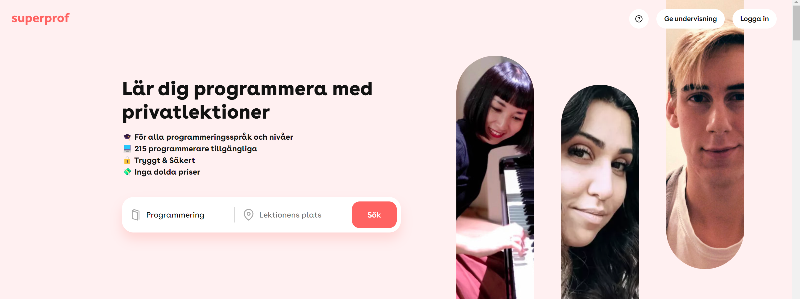

+++
title = 'Resume/CV'
date = 2024-01-07
+++


A nerdy polyglot programmer passionate about technology and innovation, **Software Developer, Systems Engineer, Architect, and IT-Security Specialist**.


  

    

      

        Contact me
      

      

        

            
              Last updated
              <time datetime="2024-04-24 20:54:27 +0200 CEST">24 April 2024</time>
            
          ·
          
            Reach out to me on
          
        

      

      <table class="text-lg mt-4 mb-0">
        <tbody>
          <tr>
            <td>
              Email
            </td>
            <td>
              <a href="mailto:william.ragstad@gmail.com">
                william.ragstad@gmail.com</a>
            </td>
          </tr>
          <tr>
            <td>
              Phone
            </td>
            <td>
              <a href="tel:+46706679706">
                +46 70-667 97 06</a>
            </td>
          </tr>
        </tbody>
      </table>
    

    

      
      William Rågstad
    

  

  <h2 class="inline" style="margin-left: 0.33rem;">
    About Me
  </h2>

 Early experience 
I have always been intrigued by games and computers.
My fascination by the ability to create something out of nothing has been a driving force in my life.

My first experience with programming was at the **age of 10**, and I have been hooked ever since.
I then got my **first job at 16** as a **Junior Backend Developer**.
My early introduction to programming has given me a head start in my studies and career.

 Education 
Studying **Computer Science** at [KTH Royal Institute of Technology](https://www.kth.se/en) has been a dream come true.
I've learned so much and met so many amazing students and professors.
Already as an **undergraduate**, I worked as a **Teaching Assistant** and **Research Assistant** along doctoral students and professors in various courses and projects. Even **teaching my fellow student colleagues** working as a TA while taking the courses myself.

 Interests 
My curiosity spans many areas, including **Competitive Programming**, **CTF**, **Hackathons**, **Startups**, **Game Dev**, **Cybersecurity**, **Systems Architecture**, **Mathematics**, **Computer Science**, **Algorithms**, **Category Theory**, **Type Theory**, **Programming Languages**, and ***much, much* more**.

 Career 
After graduating, I have been working as a self-employed **Software Developer** and **IT Specialist** consultant at [Willsoft](https://www.linkedin.com/company/willsoft-it) where I've had the opportunity to work with many projects and clients.

## Projects


 View featured projects


## Experience




I started my own consulting company, <a href="https://www.linkedin.com/company/willsoft-it" target="_blank">Willsoft</a>, providing varying services in software development and IT to small and medium-sized businesses.

<ul>
  <li>Met with management and appropriate staff to understand their requirements.</li>
  <li>Worked to find the most suitable solutions for complex problems.</li>
  <li>Created, communicated, and managed project plans.</li>
  <li>Collaborated to create strategic initiatives to design, code, and test solutions.</li>
  <li>Provided technical support and training to end-users.</li>
</ul>





Involved in the <a href="https://miking.org/" target="_blank">Miking</a> research project as part of the compiler backend team lead by David Broman.
The group is working on a new framework for constructing efficient domain-specific languages with a self-learning heterogeneous model by composition of language semantics (HMC).




Worked as a Software Developer at <a href="https://www.alextherapeutics.com/" target="_blank">Alex Therapeutics</a> in the development of a digital KBT therapy platform for mental health.
I worked with the main product (<b>React</b> and <b>Java Spring Boot</b>), and <b>developed an internal CMS tool</b> aiming to simplify in-app content updates and connect language translations together.




Working as a Teaching Assistant (TA) in <b>parallel with my education at KTH</b>.
Assisted or lead the following courses:

<ul>
  <li>Coordinator HT19-1 Introduction to Java, Stacken</li>
  <li>ID1019 <a href="https://www.kth.se/social/course/ID1019/" target="_blank">Programming II</a></li>
  <li>DH2642 <a href="https://www.kth.se/social/course/DH2642/" target="_blank">Interaction programming and dynamic web</a></li>
  <li>DM1595 <a href="https://www.kth.se/social/course/DM1595/" target="_blank">Program Development for Interactive Media</a></li>
</ul>




Private tutoring in Programming and Mathematics at <a href="https://www.superprof.se/kurser/programmering/sweden/" target="_blank">Superprof</a> for high school and university students in Stockholm.




Studying <a href="https://www.kth.se/cs/department-of-computer-science-1.1027648" target="_blank">Computer Science</a> and Engineering at department of the School of Electrical Engineering and Computer Science (EECS).




Algorithms and Data Structures on masters level in Computer Science at Örebro University <b>in parallel with High School</b>.




First programming job at <a href="https://www.mjukvarufabriken.se/" target="_blank">Mjukvarufabriken</a> as a Backend Developer.
I worked on amobile app for <a href="https://www.heabent.se/" target="_blank">HEAB</a> to make routine vehicle inspections easier.
As well as other software systems engineering related work.





  
    All my projects are hosted on Github.
  
  
  
   Visit my Github profile
  
  





