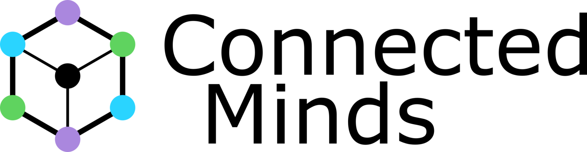
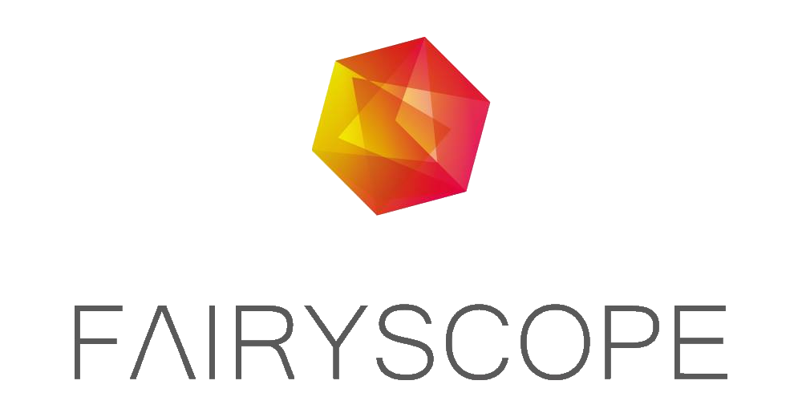

+++
title = "William Rågstad"
date = 2024-01-07
+++

<command- for="section.prose > div.max-w-prose" remove-class="max-w-prose" defer ></command->
<command- for-all=".lead" style="margin-top: 0;"></command->


Systems Engineer &nbsp;*/*&nbsp; Software Developer &nbsp;*/*&nbsp; IT-Security Specialist


  

    

      
      William Rågstad
    

    

      

        Contact me
      

      

        

          
            Reach out to me on
          
        

      

      <table class="contact mt-1 mb-0">
        <tbody>
          <tr>
            <td>
              LinkedIn
            </td>
            <td>
              <a href="https://www.linkedin.com/in/william-ragstad/" target="_blank">
                William Rågstad</a>
            </td>
          </tr>
          <tr>
            <td>
              Email
            </td>
            <td>
              <a href="mailto:william.ragstad@gmail.com">
                william.ragstad@gmail.com</a>
            </td>
          </tr>
          <tr>
            <td>
              Phone
            </td>
            <td>
              <a href="tel:+46706679706">
                +46 70-667 97 06</a>
            </td>
          </tr>
          <tr>
            <td>
              Location
            </td>
            <td>
                
                    Stockholm, Sweden
                
            </td>
          </tr>
        </tbody>
      </table>
    

  


> "As a skilled programmer,
> I aim to bring **value** and **impact** through consistent **quality** and **innovation**."


## About Me

<!--  Early experience  -->
Started programming at **11** and have been passionate about it ever since.
Got my first job when I was just **16** years old.

<!--  Education  -->
Early university studies at [ORU](https://www.oru.se/utbildning/program/civilingenjor-datateknik/) during high school.
At [KTH](https://www.kth.se/en), I worked as a **teaching assistant** and **research assistant** while still an **undergraduate** student.
Even **taught my student peers** *while* taking the same classes myself.

<!--  Hobbies  -->
Enjoy spending time with **family and friends**, working out at the gym, doing track and field athletics, playing **cello**, playing **online games**, and reading **books** and **research papers**.\
Currently deep-diving into **Programming Language Design**, **Type Theory**, and **Compiler Design**.

<!--  Personality  -->
I am excellent at **creative** **problem-solving** and enjoy **challenges** with **learning** opportunities.
I aim to be **considerate**, **kind**, **attentive**, **thorough**, **curious**, and **open-minded**.

## Experience





IT specialist at a Swedish cyber defense government agency and expert authority under of the <a href="https://www.government.se/government-of-sweden/ministry-of-defence/" target="_blank">Ministry Department of Defence</a>.




I started my own consulting company, <a href="https://www.linkedin.com/company/willsoft-it" target="_blank">Willsoft</a>, providing varying IT and software development services to small and medium-sized businesses.

<!-- <ul>
  <li>Met with management and appropriate staff to understand their requirements.</li>
  <li>Worked to find the most suitable solutions for complex problems.</li>
  <li>Created, communicated and managed project plans.</li>
  <li>Collaborated to create strategic initiatives to design, code, and test solutions.</li>
  <li>Provided technical support and training to end-users.</li>
</ul> -->




Worked as a Software Developer at <a href="https://www.alextherapeutics.com/" target="_blank">Alex Therapeutics</a> in the development of a digital KBT therapy platform for mental health.
I worked with the main full-stack product (<b>React</b> frontend and <b>Java Spring Boot</b>) and <b>developed an internal CMS tool</b> aiming to simplify in-app content updates and connect language translations.





Contributed to the <a href="https://miking.org/" target="_blank">Miking</a> research project as part of the <b>core compiler backend team</b> led by <a href="https://people.kth.se/~dbro/" target="_blank">David Broman</a> as an <b>undergraduate student</b>.
I developed the compiler to extend the application domain to include <b>web browser and native JavaScript execution environments</b>.




Working as a Teaching Assistant (TA) in:

<a href="https://www.stacken.kth.se/en/news/2019/intro/">Introduction to Java</a>,
<a href="https://www.kth.se/social/course/ID1019/" target="_blank">Programming II</a>,
<a href="https://www.kth.se/social/course/ID1212/" target="_blank">Network Programming</a>,
<a href="https://www.kth.se/social/course/ID1206/" target="_blank">Operating Systems</a>,
<a href="https://www.kth.se/social/course/DH2642/" target="_blank">Interaction programming and dynamic web</a>,
<a href="https://www.kth.se/social/course/DM1595/" target="_blank">Program Development for Interactive Media</a>,




Private tutoring in Programming and Mathematics at <a href="https://www.superprof.se/kurser/programmering/sweden/" target="_blank">Superprof</a> for high school and university students in Stockholm.




Consulting Full-Stack Developer at <b>Connected Minds</b> a Swedish consulting company.
I worked on the official website using <b>React</b> and <b>Node.js</b> and integrated a <b>CMS</b> for easy updates.
Experience with <b>UI/UX design</b>, <b>SEO optimization</b> and <b>Google Analytics</b>.




Studying <a href="https://www.kth.se/cs/department-of-computer-science-1.1027648" target="_blank">Computer Science</a> and Engineering at the Department of the School of Electrical Engineering and Computer Science (EECS).





Consultant at <a href="https://www.youtube.com/watch?v=ezsheNColAk" target="_blank">Fairyscope</a>, a Swedish startup that developed a mobile app and cloud service for sharing information at exhibitions and trade fairs.
I developed <b>backend</b> systems and <b>APIs</b> for generating custom stylized QR codes and managing user data.




<b>Studied on masters level</b> in Computer Science at <a href="https://www.oru.se/utbildning/program/civilingenjor-datateknik/" target="_blank">Örebro University</a> <b>in parallel with High School</b>.
Courses included: <b>Algorithms and Data Structures</b>, <b>Software Engineering</b>, <b>Operating Systems</b>, <b>Computer Networks</b>, and <b>Mathematics</b>.




First programming job at <a href="https://www.mjukvarufabriken.se/" target="_blank">Mjukvarufabriken</a> as a Junior Developer.
I worked on a mobile app in <b>C#</b> and <b>ASP.NET</b> for <a href="https://www.heabent.se/" target="_blank">HEAB</a> to make routine vehicle inspections easier.
As well as other software systems engineering-related work.





  <h2 class="inline" style="margin-left: 0.33rem;">
    Skills
  </h2>

### Natural Languages

  
 🇸🇪 Swedish 

  
 🇺🇸 English 

  
  &nbsp; + 2 more 

### Programming Languages

  
 Rust 

  
 C# 

  
 C 

  
 C++ 

  
 Python 

  
 Java 

  
 TypeScript 

  
 JavaScript 

  
 HTML5 / CSS3 

  
 Go 

  
 PHP 

  <!-- 
  SQL 

 -->
  
  F# 

  
  Elixir 

  
  OCaml 

  
  Haskell 

  <!-- 
  Scala 

 -->
  <!-- 
  Kotlin 

 -->
  <!-- 
  Lua 

 -->
  
 Assembly 

  <!-- 
  <a href="https://harelang.org/" target="_blank">Hare</a> 

 -->
  
Bash/Shell 

  
PowerShell 

  <!-- 
Mathematica 

 -->
  <!-- 
 Ruby 

  
 Dart 

  
 Swift 

  
 Lisp 

  
 Go 

 -->
  
  &nbsp; + more 

### Want to Learn

  
 Scala

  
 Kotlin

  
 Racket

  
 Nim

  
 Zig

  
 C3

  
 Roc

  
 Swift

  
 Dart

  
 Julia

  
 Ruby

  
 V

  
 Hare

  
 Haxe

  
 Ada

  
 R

  
 Reason

  
 ReScript

  
 Lisp

  
 Clojure

  
 Elm

  
 Grain

  
 Crystal

  
 PureScript

  
 Lean 4

  
 Idris

  
 Agda

  
 Coq

  
 HOL

  
&nbsp; + more 

<!--

  <h2 class="inline" style="margin-left: 0.33rem;">
    Technologies
  </h2>

### Web Frameworks

  
 React 

  
 HTMX 

  
 jQuery 

  
 Node.js 

  
 Deno 

  
 Flask 

  
 ASP.NET 

  
 Spring Boot 

  
 Nginx 

  
  &nbsp; + more 

### Toolchains, Runtimes and APIs

  
 Windows API 

  
 POSIX 

  
 libc / C Runtime 

  
 .NET 

  
 CLR 

  
 JVM 

  
 V8 

  
 HVM2 

  
 WASI 

  
 LLVM 

  
 CPython VM 

  
  &nbsp; + more 

  <h2 class="inline" style="margin-left: 0.33rem;">
    Specializations
  </h2>

I am interested in many areas including **CTFs**, **Competitive Programming**, **Cybersecurity**, **Programming Languages**, **Type Theory**, and *much more*.

### Practical Skills

  
 Systems Programming 

  
 Web Development 

  
 Cybersecurity 

  
 Compiler Design 

  
 Software Architecture 

  
 Networking 

  
 Operating Systems 

  
 Game Development 

  
  &nbsp; + more 

### Computer Science

  
 Data Structures 

  
 Algorithms 

  
 Design Patterns 

  
 Cryptography 

  
 Prog. Language Design 

  
 Lambda Calculus 

  
 Interaction Nets 

  
 Type Theory 

  
 Formal Methods 

  
 Category Theory 

  
 HCI 

  
 Machine Learning 

  
 Computer Graphics 

  
  &nbsp; + more 

-->

## Projects

I have created many projects, including **Programming Languages**, **Websites**, **Games**, **Tools & Libraries**, **Research**, and **much more**.
View some of my featured projects and contributions below.

  
  
  
  
  
  
  <!--  -->
  <!--  -->
  <!--  -->
  
  
  
  <!--  -->
  
  
  
  <!-- 
  
  
   -->

If you are interested to see all of my projects, check them out here:


&nbsp;&nbsp;Featured Projects

&nbsp;&nbsp;

&nbsp;&nbsp;Github Profile

&nbsp;&nbsp;

&nbsp;&nbsp;Blog Posts


  <h2 class="inline" style="margin-left: 0.33rem;">
    Highlights
  </h2>

I have participated in various **competitive programming** contests, **hackathons**, **startups**, and **CTF** competitions
playing in the **Swedish National Hacking Team** and the **RoyalRoppers** CTF teams.

<ul class="highlights_list">
    <li>
        <b><em>Creator</em>, Programming Languages</b>: Designed and implemented interpreters and compilers for <a href="https://lento-lang.org/" target="_blank">Lento</a>, <a href="https://webx.sh/" target="_blank">Web X</a>, and <a href="https://www.mini-lang.org/" target="_blank">mini</a>, among others.
    </li>
    <li>
        <b><em>Compiler Team</em>, <a href="https://miking.org/" target="_blank">Miking</a></b>: A framework for constructing efficient domain-specific languages.
    </li>
    <li>
        <b><em>Member</em>, <a href="https://www.sigplan.org/" target="_blank">ACM SIGPLAN</a></b>: Association for Computing Machinery's Special Interest Group on Programming Languages.
    </li>
    <li>
        <b><em>Board Member</em>, <a href="https://www.stacken.kth.se/en" target="_blank">KTH Stacken</a> Computer Club</b>: Attended weekly meetups and presented on programming topics.
    </li>
    <li>
        <b><em>Organizer</em>, <a href="https://undutmaning.se/" target="_blank">Undutmaning CTF</a> 2023, 24, 25</b>: Technical project manager for the website, infrastructure, and challenges.
    </li>
    <li>
        <b><em>CTF Team Member</em>, <a href="https://royalroppers.team/" target="_blank">RoyalRoppers</a></b>: Expertise in reverse engineering, web, network, binary exploitation, cryptography, and more.
    </li>
    <!--
    <li>
        <b><em>Developer</em>, <a href="https://github.com/WilliamRagstad" target="_blank">100+ GitHub Projects</a></b>: Strong technical expertise in <a href="https://en.wikipedia.org/wiki/Open-source_software" target="_blank">OSS</a>-dev. Some with over <b>200,000+ users</b> worldwide.
    </li>
    <li>
        <b><em>Participant</em>, <a href="https://snht.se/" target="_blank">Swedish National Hacking Team</a> Bootcamp</b>: Preparation for <a href="https://ecsc.eu/" target="_blank">ECSC</a> competition against 20+ countries.
    </li>
    <li>
        <b><em>Competitor</em>, <a href="https://ctftime.org/event/2229" target="_blank">DEFCON CTF Qualifier</a> 2024</b>: In the <a href="https://norsecode.team/" target="_blank">NorseCode</a> team via <a href="https://royalroppers.team/" target="_blank">RoyalRoppers</a> and <a href="https://ctftime.org/team/114856" target="_blank">Kalmarunionen</a> in <b>Denmark</b>.
    </li> -->
</ul>

View my full resume at: [williamr.dev/resume](https://williamr.dev/resume).


&nbsp;Download PDF&nbsp;

&nbsp;


&nbsp;Print Resume&nbsp;



    resume
    cv
    curriculum vitae
    career
    work
    experience
    research
    teaching
    tutoring
    university
    college
    school
    education
    consulting
    projects
    skills
    programming
    languages
    technologies
    specializations


