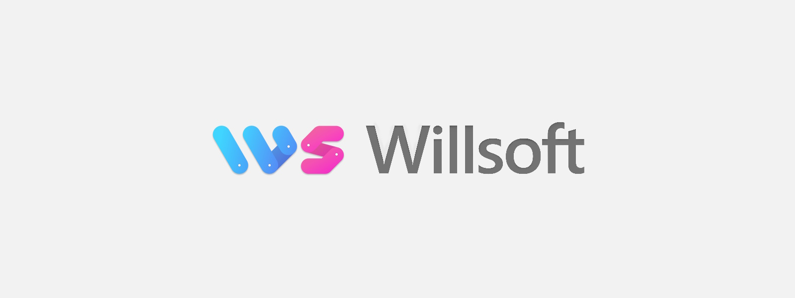

+++
title = "William Rågstad - Resume"
date = 2024-01-07
+++


`Software Developer`, `Systems Engineer`, `IT-Security Specialist`, + more


  

    

      
      William Rågstad
    

    

      

        Contact me
      

      

        

            
              Last updated
              <time datetime="2024-04-24 20:54:27 +0200 CEST">24 April 2024</time>
            
          ·
          
            Reach out to me on
          
        

      

      <table class="contact mt-4 mb-0">
        <tbody>
          <tr>
            <td>
              Email
            </td>
            <td>
              <a href="mailto:william.ragstad@gmail.com">
                william.ragstad@gmail.com</a>
            </td>
          </tr>
          <tr>
            <td>
              Phone
            </td>
            <td>
              <a href="tel:+46706679706">
                +46 70-667 97 06</a>
            </td>
          </tr>
        </tbody>
      </table>
    

  

 


&mdash; As a skilled programmer passionate about technology and learning,
I aim to bring **value** and **impact** through consistent **quality** and **innovation**.


## About Me

 Early experience 
I have always been intrigued by games and computers.
My fascination with the ability to create something out of nothing has been a driving force in my life.

My first experience with programming was at the **age of 10**, and I have been hooked ever since.
I then got my **first job at 16** as a **Junior Backend Developer**.
My early introduction to programming has given me a head start in my studies and career.

 Education 
Studying **Computer Science** at [KTH Royal Institute of Technology](https://www.kth.se/en) has been a dream come true.
I've learned so much and met so many amazing students and professors.
Already as an **undergraduate**, I worked as a **Teaching Assistant** and **Research Assistant** along with doctoral students and professors in various courses and projects. Even **taught my fellow student colleagues** working as a TA while taking the courses myself.

 Interests 
My curiosity spans many areas, including **Competitive Programming**, **CTF**, **Hackathons**, **Startups**, **Game Dev**, **Cybersecurity**, **Systems Architecture**, **Mathematics**, **Computer Science**, **Algorithms**, **Category Theory**, **Type Theory**, **Programming Languages**, and ***much, much* more**.

 Career 
After graduating, I have been working as a self-employed **Software Developer** and **IT Specialist** consultant at [Willsoft](https://www.linkedin.com/company/willsoft-it) where I've had the opportunity to work with many projects and clients.

  <h2 class="inline" style="margin-left: 0.33rem;">
    Highlights
  </h2>

- ***Competitor*, [DEFCON CTF Qualifier](https://ctftime.org/event/2229) 2024**: In the [NorseCode](https://norsecode.team/) team via [RoyalRoppers](https://royalroppers.team/) together with [kalmarunionen](https://ctftime.org/team/114856) in **Denmark**. Featured *high-stakes* cybersecurity challenges.

- ***Organizer*, [Undutmaning](https://undutmaning.se/) CTF 2024**: Technical project manager of a well-regarded cyber-security competition. Built a variety of challenges, the official website, and infrastructure.

- ***Participant*, [Swedish National Hacking Team](https://snht.se/) 2023**: In the [European Cybersecurity Challenge](https://ecsc.eu/) (ECSC) in **Norway**. Competed against 20+ European countries in a variety of CTF challenges.

- ***Member*, [RoyalRoppers](https://royalroppers.team/) CTF Team**: Contributing to several CTF competitions through advanced problem-solving skills in reverse engineering, web, network, and binary exploitation.

- **[GitHub Project](https://github.com/WilliamRagstad/Font-Manager) with 200,000+ Users**: Lead developer showcasing strong leadership and technical expertise in open-source software development.

  <h2 class="inline" style="margin-left: 0.33rem;">
    Skills
  </h2>

### Natural Languages

  
 Swedish 

  
 English 

  
  &nbsp; + 2 more 

### Programming Languages

  
 Rust 

  
 C# 

  
 Java 

  
 Python 

  
 C++ 

  
 C 

  
 TypeScript 

  
 JavaScript 

  
 HTML5 / CSS3 / Sass 

  
 PHP 

  
 SQL 

  
 Lua 

  
 F# 

  
 Elixir 

  
 OCaml 

  
 Haskell 

  
 x86/x64 Assembly 

  
 Bash/Shell 

  
 PowerShell 

  
  &nbsp; + more 

  <h2 class="inline" style="margin-left: 0.33rem;">
    Technologies
  </h2>

### Web Frameworks

  
 React 

  
 HTMX 

  
 jQuery 

  
 Node.js 

  
 Deno 

  
 Flask 

  
 ASP.NET 

  
 Spring Boot 

  
 Nginx 

  
  &nbsp; + more 

### Toolchains, Runtimes and APIs

  
 Windows API 

  
 POSIX 

  
 libc / C Runtime 

  
 .NET 

  
 CLR 

  
 JVM 

  
 V8 

  
 HVM2 

  
 WASI 

  
 LLVM 

  
 CPython VM 

  
  &nbsp; + more 

### Databases

  
 PostgreSQL 

  
 MySQL 

  
 MariaDb 

  
 SQLite 

  
 MongoDB 

  
 Firebase 

  
  &nbsp; + more 

  <h2 class="inline" style="margin-left: 0.33rem;">
    Specializations
  </h2>

### Practical Systems Skills

  
 Systems Programming 

  
 Web Development 

  
 Compiler Design 

  
 Cybersecurity 

  
 Architecture 

  
 Game Development 

  
 Networking 

  
 Operating Systems 

  
 Distributed Systems 

  
 DevOps 

  
  &nbsp; + more 

### Computer Science Theory

  
 Algorithms 

  
 Data Structures 

  
 Design Patterns 

  
 Cryptography 

  
 Type Theory 

  
 Interaction Nets 

  
 Formal Methods 

  
 Combinatory Logic 

  
 HCI 

  
 Computer Graphics 

  
 Machine Learning 

  
  &nbsp; + more 

## Projects

View my featured projects and contributions via the links below.


&nbsp;&nbsp;Featured Projects

&nbsp;&nbsp;

&nbsp;&nbsp;Github Profile

&nbsp;&nbsp;

&nbsp;&nbsp;Blog Posts


## Experience





IT specialist at a Swedish government agency under the <a href="https://www.government.se/government-of-sweden/ministry-of-defence/" target="_blank">Ministry of Defence</a>.




I started my own consulting company, <a href="https://www.linkedin.com/company/willsoft-it" target="_blank">Willsoft</a>, providing varying IT and software development services to small and medium-sized businesses.

<!-- <ul>
  <li>Met with management and appropriate staff to understand their requirements.</li>
  <li>Worked to find the most suitable solutions for complex problems.</li>
  <li>Created, communicated and managed project plans.</li>
  <li>Collaborated to create strategic initiatives to design, code, and test solutions.</li>
  <li>Provided technical support and training to end-users.</li>
</ul> -->




Worked as a Software Developer at <a href="https://www.alextherapeutics.com/" target="_blank">Alex Therapeutics</a> in the development of a digital KBT therapy platform for mental health.
I worked with the main full-stack product (<b>React</b> frontend and <b>Java Spring Boot</b>) and <b>developed an internal CMS tool</b> aiming to simplify in-app content updates and connect language translations.





Contributed to the <a href="https://miking.org/" target="_blank">Miking</a> research project as part of the <b>core compiler backend team</b> led by <a href="https://people.kth.se/~dbro/" target="_blank">David Broman</a> as an <b>undergraduate student</b>.
I developed the compiler to extend the application domain to include <b>web browser and native JavaScript execution environments</b>.




Working as a Teaching Assistant (TA) in <b>parallel with my education at KTH</b>.
Assisted or lead the following courses:

<ul>
  <li>Coordinator HT19-1 Introduction to Java, Stacken</li>
  <li>ID1019 <a href="https://www.kth.se/social/course/ID1019/" target="_blank">Programming II</a></li>
  <li>DH2642 <a href="https://www.kth.se/social/course/DH2642/" target="_blank">Interaction programming and dynamic web</a></li>
  <li>DM1595 <a href="https://www.kth.se/social/course/DM1595/" target="_blank">Program Development for Interactive Media</a></li>
</ul>




Private tutoring in Programming and Mathematics at <a href="https://www.superprof.se/kurser/programmering/sweden/" target="_blank">Superprof</a> for high school and university students in Stockholm.




Studying <a href="https://www.kth.se/cs/department-of-computer-science-1.1027648" target="_blank">Computer Science</a> and Engineering at the Department of the School of Electrical Engineering and Computer Science (EECS).




Algorithms and Data Structures on masters level in Computer Science at Örebro University <b>in parallel with High School</b>.




First programming job at <a href="https://www.mjukvarufabriken.se/" target="_blank">Mjukvarufabriken</a> as a Backend Developer.
I worked on a mobile app for <a href="https://www.heabent.se/" target="_blank">HEAB</a> to make routine vehicle inspections easier.
As well as other software systems engineering-related work.





  
    All my projects are hosted on GitHub.
  
  
  
  &nbsp;&nbsp;Github Profile
  
  





